# ingTools 

**TBSP**开发辅助插件（For IDEA），针对日常开发提供便捷支持。

参考链接： [IDEA插件开发官方SDK](http://www.jetbrains.org/intellij/sdk/docs/welcome.html)

交流QQ群：`933819491`

> 注意：本插件的IDEA开发版本为`2018.1`， 为确保正常使用，请尽可能使用相近版本，兼容性问题请反馈给[wucp26649@hundsun.com](wucp26649@hundsun.com)，本地如何导入插件项目，参见[这里](<https://github.com/BlueDriver/ingTools/blob/master/help.md>)

## 1. 本地安装插件

### 1.1  打开设置，按照下图步骤点击

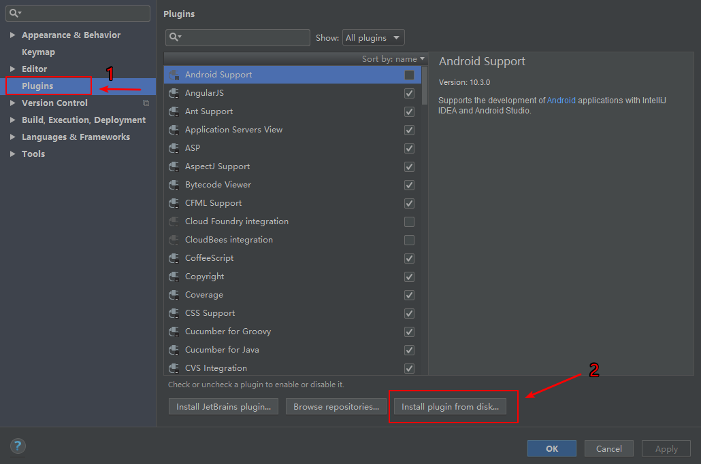

### 1.2  选择本插件压缩包，OK后重启IDEA

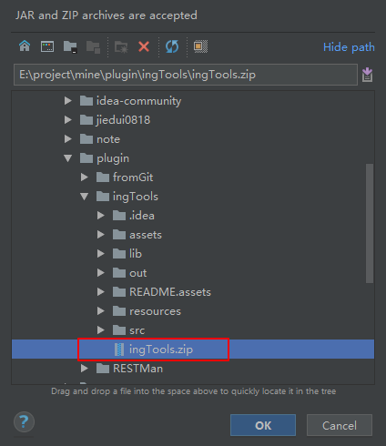

## 2. 功能介绍

### 2.1 代码跳转(InterImplTestEnumProvider)
#### 2.1.1 跳转关系

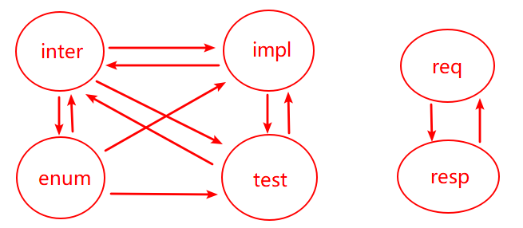

> 以交易码为关联关系，实现各层间的连接（req和resp类除外）

#### 2.1.2 如何使用？

初次使用需要配置交易码类：

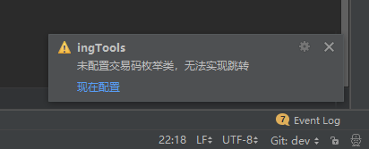

在弹出的输入框中填入项目对应的 **交易码枚举类名称**（不要后缀），然后重新打开2.1.1图中任一类代码即可，**建议重启IDEA更好**。

配置好之后就是这样的：

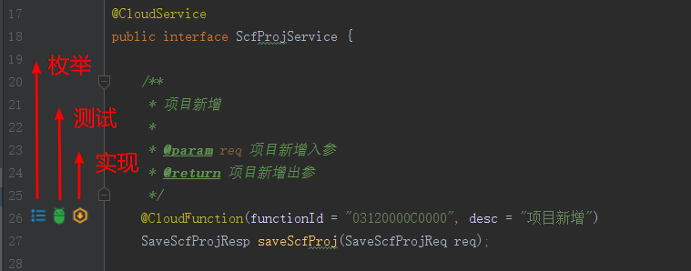

上面三种图标对应三种跳转关系，点击他们就能直接跳转了。

枚举类中：

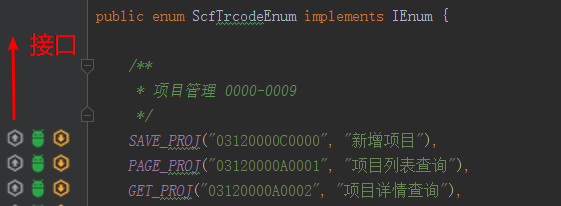

req和resp的相互跳转：

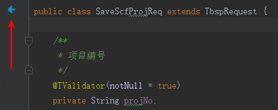

> 注意：可能有时候无法出现跳转图标，建议清理缓存并重启IDEA

### 2.2 重复code提示(IEnumCodeRepeatedAnnotator)

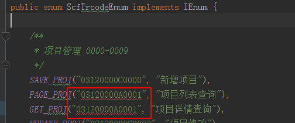

> 仅针对实现了`IEnum`的枚举有效

### 2.3 生成java类的field(GenerateFields)

对于类字段较多的情况，就可以这么玩：

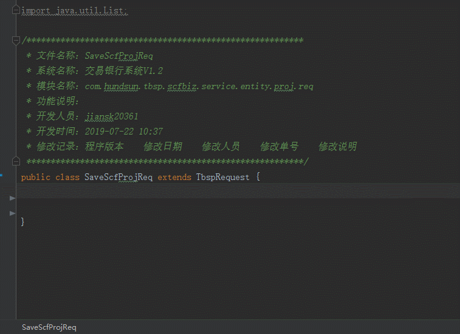

> 从文档中复制字段定义内容，可直接生成类字段。三列分别对应字段名、注释、类型，注意选择分隔符是`Tab`还是`空格` ，其中，第三列可不选，则默认为`String·`类型

用法为单击右键弹出`ingTools`菜单：

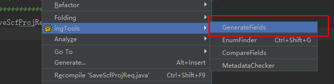

### 2.4 枚举查找(EnumFinder)

提供本地快速枚举查找：
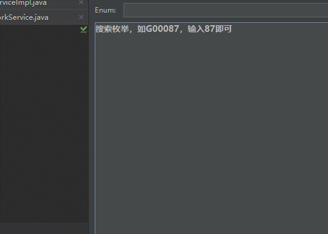

> 使用前需要配置本地枚举类jar包路径

### 2.5 字段对比(CompareFields)

需求经常改，字段总是变，都搞不清哪些字段动过了，看看这个吧：
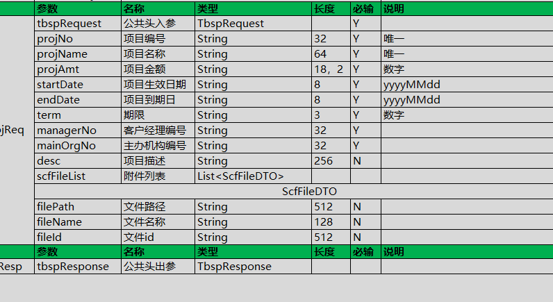

> 左右两栏分别为当前类中字段和文档列字段（当然，需要手动copy出来），点击Compare就能比出来谁多谁少了

### 2.6 req类元数据校验(MetadataChecker)

提供对req类中含`TValidator`字段的一键查询，结果会显示在表中，库中没有的记录租户号为`null`，使用前要配置好数据源。建议开发人员写完req类后，就进行此校验操作，尽量避免字段名重复。
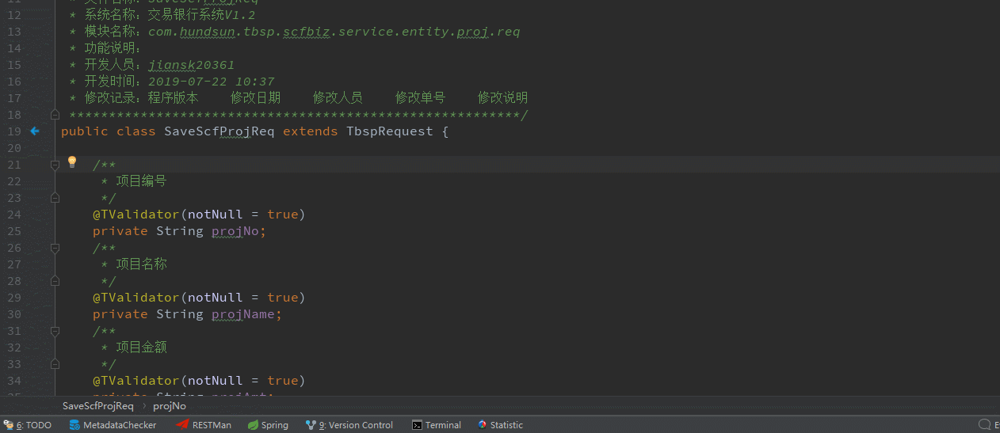

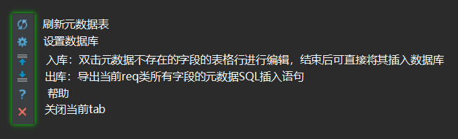

> 注意：入库操作，仅针对库中无此字段的情况，此操作仅仅是新增记录，修改已有元数据不会执行更新操作。表格编辑完后，若仍然处于焦点状态，此行数据不会被入库操作发现，需要点击其他地方先让表格失去焦点，再点击入库按钮。

另外：

> 这里仅是对单个req的元数据有出库操作，实际开发中不可能一个个req的去做，怎么对所有req类元数据出库操作呢？继续往下看**2.11**吧

### 2.7 CSV文件生成(Generate CSV)

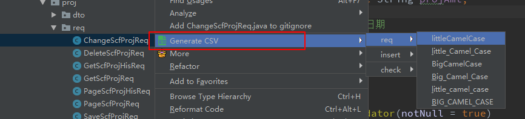

> 在类文件上右键菜单，选择`Generate CSV`， 再选择类型，对应CSV文件就会在同目录下生成

### 2.8 国际化文件生成(Generate i18n File)

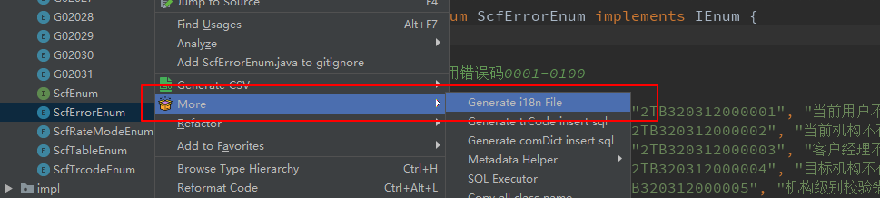

> 在错误枚举类上选择本功能，同目录下就就会生成对应`properties`文件。注意可能存在**编码问题**，此时只要将文件内容复制出来，覆盖到原国际化文件中即可

### 2.9 交易码SQL文件生成(Generate trCode insert sql)

在交易码枚举类上执行，将各个枚举转换成对应的SQL插表语句，注意某些字段需要根据需要自行修改

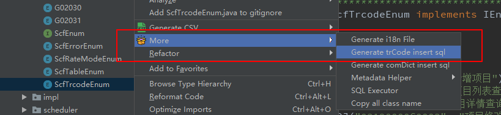

### 2.10 字典SQL文件生成(Generate comDict insert sql)

系统字典不能满足需要的情况下，产品内部会定义其他枚举字典，其对应的SQL入库语句便可由此生成

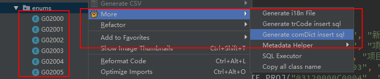

> 在含有字典枚举的**包** 上执行本操作，注意枚举名必须是`Gxxxxx`格式，且实现了`IEnum`接口

另外，鉴于`COM_DICT`表中有`REMARK`字段，强烈建议在枚举类中增加该属性以便生成SQL时，`REMARK`字段能够有此备注，若枚举类中无`remark`属性，则该SQL中`REMARK`字段值为此枚举类名（这样并没有什么意义）

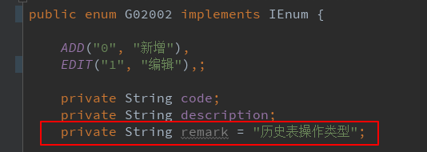

### 2.11 元数据批量导出(Metadata Helper)

前面2.6讲过对单个req类属性元数据的查询和导出操作，这里将展示对所有req类元数据的导出操作

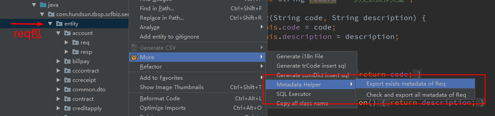

在req包上执行导出：
* Export exists metadata of Req：导出数据库中存在包下的Req类的metadata数据
* Check and export all metadata of Req：检验并导出数据库全部包下Req类的metadata，若有一个不存在，则会抛出错误，此法往往用于检验漏网之鱼

> 注意：只要有`TValidator`注解的属性，就会视为导出对象，使用时请严格遵守注解使用规范

### 2.12 SQL执行器(SQL Executor)

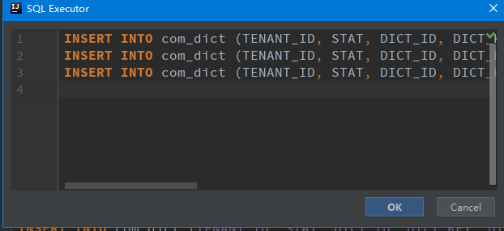

> 原理：逐条执行SQL，每条语句执行互不影响执行结果，注意SQL必须是单行的。此功能常用于多次往数据库导入数据且不知道有哪些数据重复的场景

### 2.13 复制包下所有类名(Copy all class name)

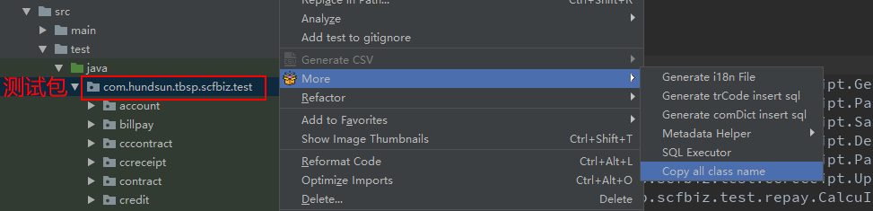

> 集中跑单测类时，不用一个个类名复制到`RunnerMain`中了，直接在测试类包上执行本操作即可，**注意去掉`RunnerMain`类自身**

### 2.14 模板代码生成(Generate Impl & Generate Test)

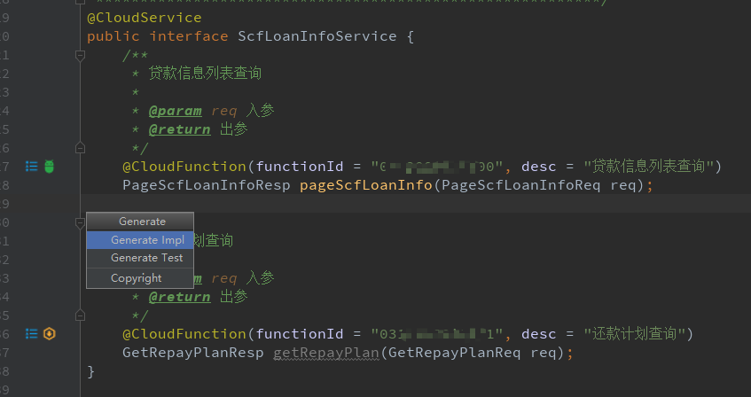

在服务接口类中按下`alt+insert`键，弹出选项：

* Generate Impl：生成实现类模板代码，格式如下，#XXX为占位符

```
package #PACKAGE;

import com.hundsun.tbsp.commbiz.BizTemplate;
import #FULL_NAME_REQ;
import #FULL_NAME_RESP;
import #TR_CODE_ENUM;
import org.springframework.stereotype.Component;

import java.util.Map;

/*********************************************************
 * 文件名称：#CLASS_NAME.java
 * 系统名称：交易银行系统V2.0
 * 模块名称：#PACKAGE
 * 功能说明：#DESC
 * 开发人员：#USER_NAME
 * 开发时间：#DATE_TIME
 * 修改记录：程序版本    修改日期    修改人员    修改单号    修改说明
 *********************************************************/
@Component
public class #CLASS_NAME implements BizTemplate<#REQ, #RESP> {
    /**
     * 获取交易码
     */
    @Override
    public String getTrCode() {
        return #TRCODE;
    }

    /**
     * 业务校验
     *
     * @param req  服务入参
     * @param resp 服务出参
     * @param map  扩展字段
     */
    @Override
    public void checkBusiness(#REQ req, #RESP resp, Map<String, Object> map) {

    }

    /**
     * 业务本地处理
     */
    @Override
    public void handle(#REQ req, #RESP resp, Map<String, Object> map) {

    }

    /**
     * 业务处理（远程调用）
     */
    @Override
    public void remoteHandle(#REQ req, #RESP resp, Map<String, Object> map) {

    }

    /**
     * 业务后处理
     */
    @Override
    public void afterHandler(#REQ req, #RESP resp, Map<String, Object> map) {

    }
}
```

* Generate Test：生成测试类模板代码，格式如下

```
package #PACKAGE;

import com.hundsun.jrescloud.common.util.SpringUtils;
import com.hundsun.tbsp.junit.TcBaseTest;
import com.hundsun.tbsp.junit.csv.CSVSupport;
import com.hundsun.tbsp.junit.csv.DataAssist;
import #FULL_NAME_REQ;
import #FULL_NAME_RESP;
import #FULL_NAME_SERVICE;
import mockit.Mock;
import mockit.MockUp;
import mockit.Mocked;
import org.junit.Assert;
import org.junit.Test;
import org.junit.runner.RunWith;
import org.junit.runners.Parameterized;
import org.springframework.beans.factory.annotation.Autowired;
import org.springframework.boot.test.context.SpringBootTest;
import org.springframework.test.util.ReflectionTestUtils;

import java.util.ArrayList;
import java.util.Arrays;
import java.util.Collection;
import java.util.List;

/*********************************************************
 * 文件名称：#CLASS_NAME.java
 * 系统名称：交易银行系统V2.0
 * 模块名称：#PACKAGE
 * 功能说明：#DESC
 * 开发人员：#USER_NAME
 * 开发时间：#DATE_TIME
 * 修改记录：程序版本    修改日期    修改人员    修改单号    修改说明
 *********************************************************/
@RunWith(Parameterized.class)
@SpringBootTest(classes = {}) //TODO: 填入启动类
public class #CLASS_NAME extends TcBaseTest {
    private #REQ req;
    private static int no = 0;

    @Autowired
    private #SERVICE service;

    public #CLASS_NAME(#REQ req) {
        this.req = req;
        this.initTbspRequest(req, "#TRCODE", 10);
        no++;
    }

    @Parameterized.Parameters
    public static Collection<Object> data() {
        //TODO: Create REQ CSV file
        List<#REQ> list = CSVSupport.getListFromCSV(#REQ.class, "");
        Object[] obj = new Object[list.size()];
        for (int i = 0; i < list.size(); i++) {
            obj[i] = new Object[]{list.get(i)};
        }
        return Arrays.asList(obj);
    }

    @Test
    public void test() {
        List<String> delSqls = new ArrayList<>();
        try {
            if (no == 1) {
                //mock();
                //delSqls.addAll(DataAssist.readDataFromCsv("", ""));

                #RESP resp = service.#METHOD_NAME(req);

                System.err.println("resp msg: " + resp.getRespMsg());
                Assert.assertEquals("S", resp.getRespType());

                //checkCSV("", resp.getDto(), 1);

                //listMultCheck(resp.getDtos(), "", "1");

                //DBCheck("", "", 1);
            }
        } finally {
            DataAssist.execSqls(delSqls, "");
            //删除流水
            DBDeleteSingle("TBSP_JNL", "TR_CODE", req.getHeadTrCode(), "TENANT_ID", req.getHeadTenantId());
        }
    }

    //region mock使用示例
    /*
    @Mocked
    private MockService mockService;

    private void mock() {
        MockUp<MockService> mockServiceMockUp = new MockUp<MockService>() {
            @Mock
            MockDTO get(String tenantId, String orgNo) {
                MockDTO dto = new MockDTO();
                return dto;
            }
        }
        mockService = mockServiceMockUp.getMockInstance();
        MockComponnet mockComponnet = SpringUtils.getBean(MockComponnet.class);
        ReflectionTestUtils.setField(mockComponnet, "mockService", mockService);
    }
    */
    //endregion
}
```

>  操作时选择要实现的方法和指定生成文件所在的包即可，**注意要先配置交易码枚举类，见2.1.2**

### 2.15 Example分析(Analyze Example)

针对多人开发的场景，同条件查询可能写成多种情况

```java
//第一种：
UserExample example = new UserExample();
example.createCriteria()
	.andNameEqualsTo("A")
   	.andAgeEqualsTo(10)
    .andGenderEqualsTo("M");
//第二种：
UserExample example = new UserExample();
example.createCriteria()
	.andAgeEqualsTo(10)
    .andNameEqualsTo("A")
    .andGenderEqualsTo("M");
//第三种：
UserExample example = new UserExample();
example.createCriteria()
    .andGenderEqualsTo("M")
    .andAgeEqualsTo(10)
    .andNameEqualsTo("A");
//等等。。。
```

如上，其实都归为相同的条件查询，仅仅是组合顺序不同，这给建立表索引等带来一定困扰，逐个审查代码来统一似乎工作量太大。试试这个吧：

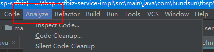

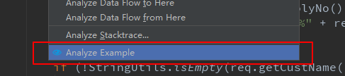

菜单栏选择`Analyze`，再选择`Analyze Example`，在弹出的选择框中选择DAO层（Entity，Example，Mapper所在包）的包和服务实现层的包（使用了Example作查询的类所在的包，一般为业务实现层）

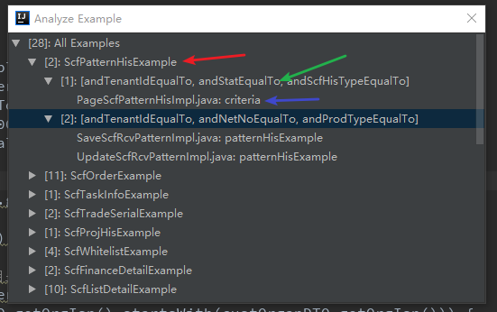

如上，各个Example的使用情况就统计出来了，针对同条件而不同顺序的语句，方便进行代码统一调整

* 红箭头节点：对应一类Example，子节点为为用到的查询条件（两个即以上的，单个的忽略），单击可直接复制实体类对应的建索引SQL，建议先调整好所有此类Example引用的代码语句再执行
* 绿箭头节点：某类Example的查询条件（两个及以上同时出现的），显示实为第一个子节点的查询条件组合顺序，单击可复制本条件组合的建索引SQL，子节点为具体的代码使用语句
* 蓝箭头节点：条件查询代码语句块，**点击可直接跳转到代码**

> 注意先调整好查询条件代码，再复制对应的索引SQL，否则无实际意义，选包时尽可能缩小包的范围，以加快执行速度

### 2.16 out.xml和in.xml中重复值提示

out.xml中：

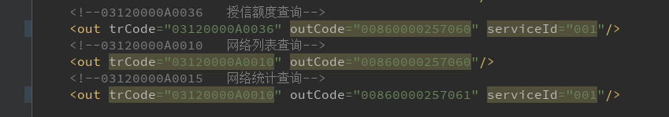

> 验重属性包括：`trCode`, `outCode`, `serviceId`，重复的项会有如图背景色

---

in.xml中：

> 验重属性仅为：`trCode`

### 2.17 req调用getXXX()可能为`null`提供弱提醒（ReqGetterCallWarningAnnotator）

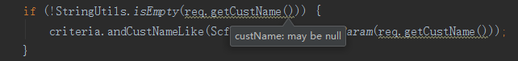

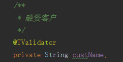


> 原理：判断属性上是否有`@TValidator(notNUll = true)`


## 更多

> 敬请期待！欢迎意见和反馈：wucp26649@hundsun.com

