## IDEA插件项目克隆下来后，如何在IDEA中导入？

1. 打开Project Structure

   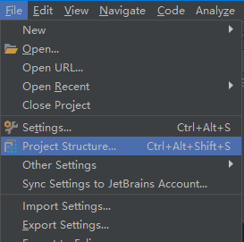

2. 选择SDK

   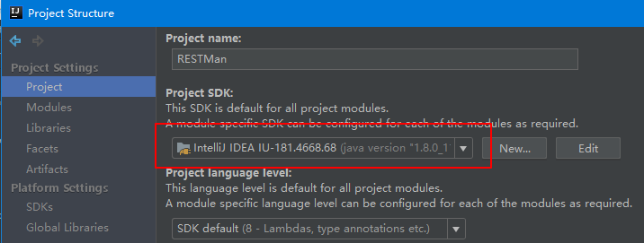

3. 转到Modules，点击+号，选择New Module

   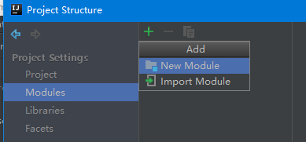

4. 选择模块类型为IntelliJ Platform Plugin，然后Next

   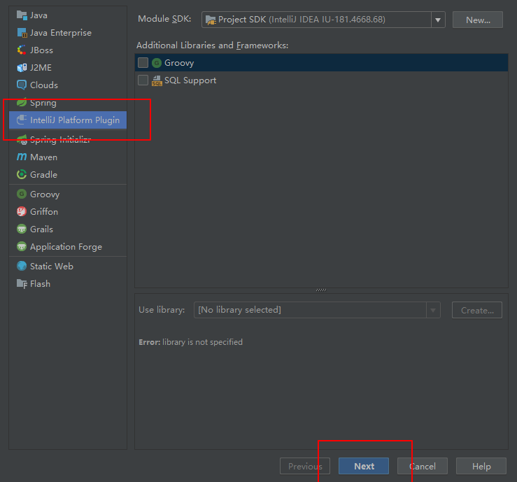

5. 选择模块路径，即项目路径

   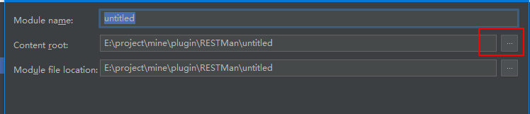

   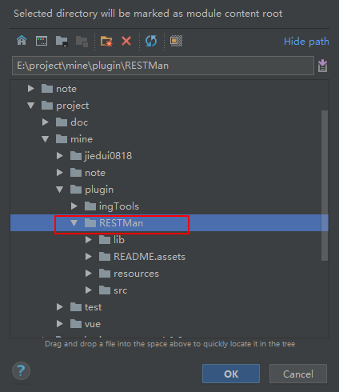

选完后如下，然后Finish

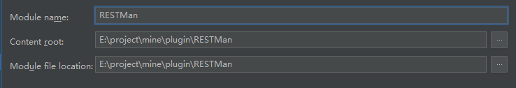

6. 出现插头图标就表示OK了

   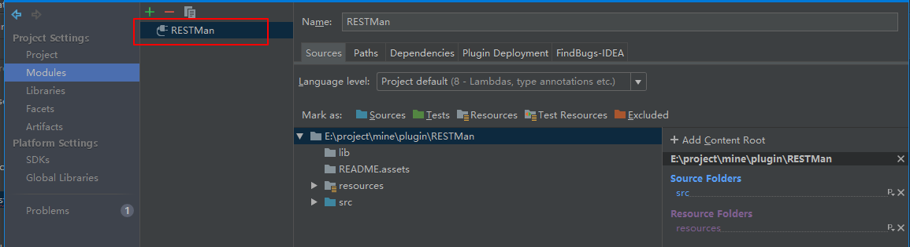

## 怎么运行？

1. 配置运行方式

   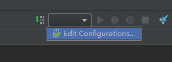

2. 选择Plugin，然后选Use classpath of module下拉框，选择我们刚刚那个模块即可

   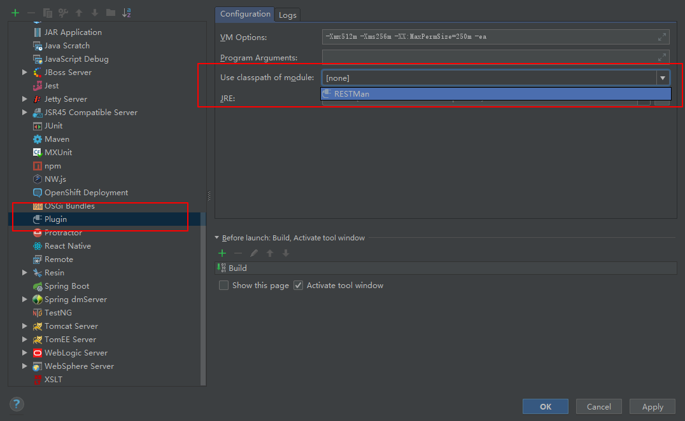

3. 完成后，Name随意取即可

   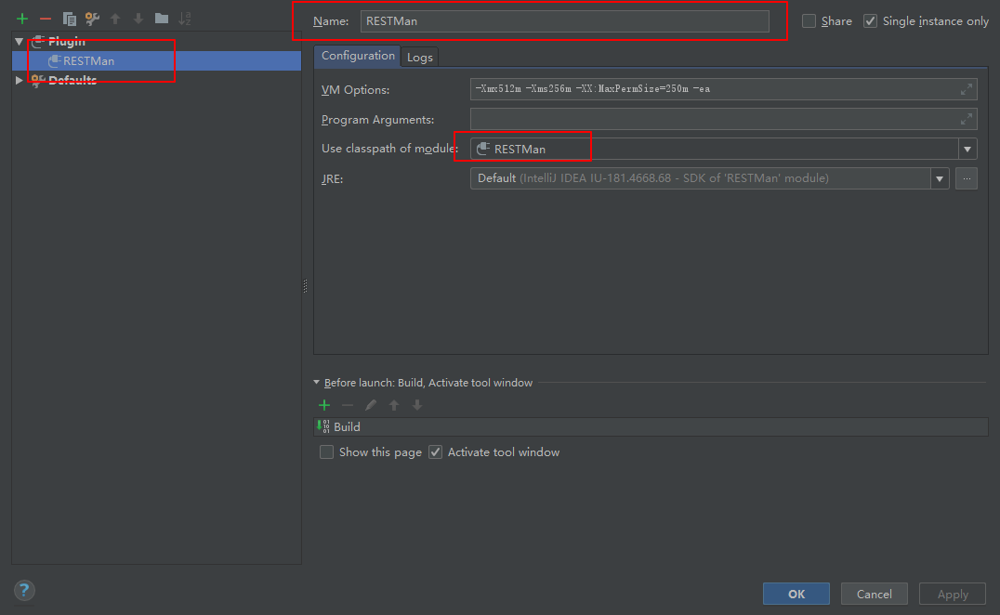

4. 运行配置出现插件选项
   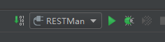

